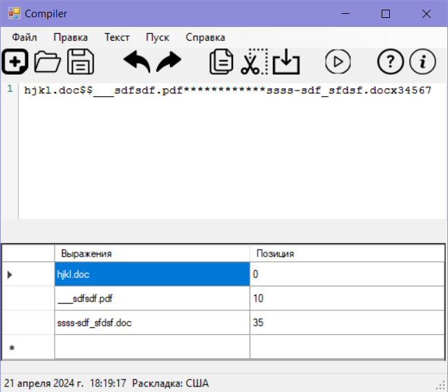
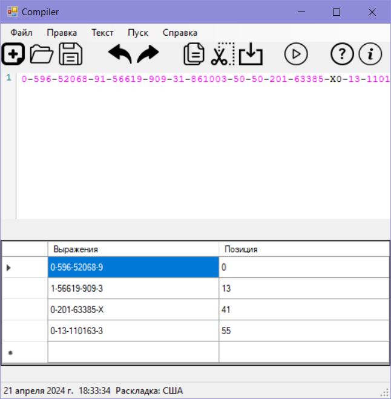
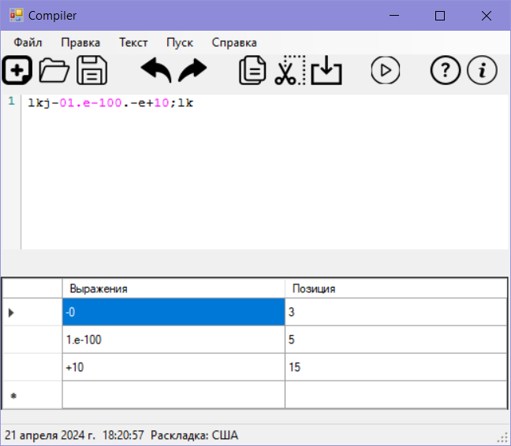

# Лабораторная работа №6 Реализация алгоритма поиска подстрок с помощью регулярных выражений

### РВ, описывающее формат имени файла .doc, .docx, .pdf 

[a-zA-Z0-9\-_]+\.(doc|docx|pdf)

### РВ для проверки ISBN-10

(0|1|2|3|4|5|7|8[0-9]|9[0-4]|60[0-9]|61[0-9]|62[0-9]|63[0-9]|64[0-9]|95[0-9]|96[0-9]|97[0-9]|98[0-9]|99[0-3]|994[0-9]|995[0-9]|996[0-9]|997[0-9]|998[0-9]|9990[0-9]|9991[0-9]|9992[0-9]|9993[0-9]|9994[0-9]|9995[0-9]|9996[0-9]|9997[0-9]|9998[0-9]|9999[0-9])-([0-9]{2,7})-([0-9]{1,6})-([0-9]|X)

### РВ, описывающее действительное число (с учетом экспоненциальной записи).

[-+]?((0(\.[0-9]+)?)|([1-9][0-9]*\.?[0-9]*))([eE][-+]?[1-9][0-9]*)?

